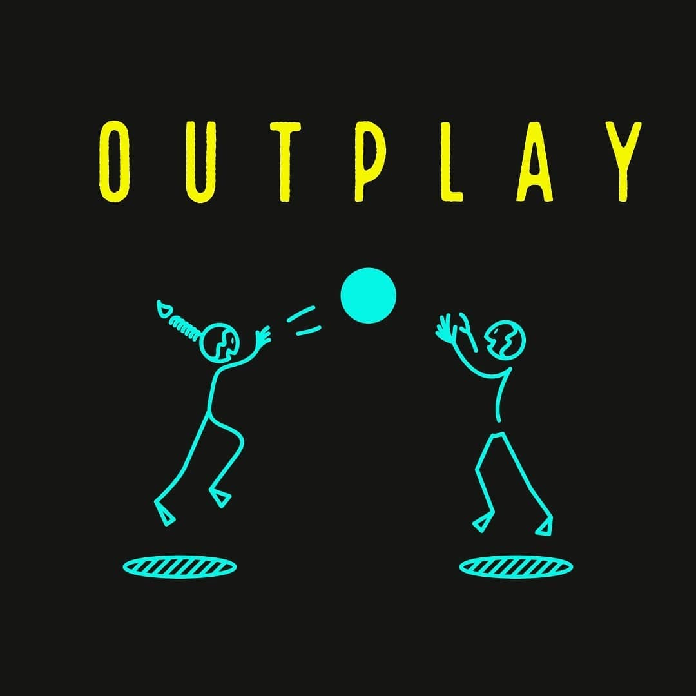

# OUTPLAY — E-Commerce Demo Website

> A bold, interactive e-commerce demo for **Outplay**, a South African streetwear brand. Built with pure HTML, CSS, and JavaScript — no frameworks, no dependencies.



---

## 🔥 Live Demo

> Deploy via GitHub Pages — see setup instructions below.

---

## 📄 Pages

| Page | File | Description |
|------|------|-------------|
| Home | `index.html` | Hero slideshow, featured products, brand story, graphics showcase, newsletter |
| Shop | `shop.html` | Full product grid with colour filters, size selector, sizing guide |
| About | `about.html` | Brand manifesto, values, story timeline, logo showcase |
| Contact | `contact.html` | Contact form, FAQ accordion, shipping & returns info |
| Checkout | `checkout.html` | Full 4-step demo checkout with order confirmation |

---

## ✨ Features

- **Custom cursor** with magnetic ring follow effect
- **Hero image slideshow** with auto-play and manual dot controls
- **Persistent cart** using `localStorage` — survives page navigation
- **Cart sidebar** with add/remove items, running total in ZAR (R)
- **Product filters** by colour on the shop page
- **4-step checkout flow:**
  - Delivery address with SA province selector
  - Shipping method (Standard / Express / Overnight)
  - Payment options: Card, EFT, PayFlex, SnapScan
  - Order review + animated confirmation screen
- **Auto-fill demo data** buttons throughout checkout
- **Working promo code:** `OUTPLAY10` (10% off)
- **Scroll-reveal animations** on all sections
- **Responsive** — works on mobile and desktop
- **Scrolling marquee** announcement bar
- **Newsletter signup** with validation
- **Interactive FAQ accordion** on contact page
- **Sizing guide table** in centimetres

---

## 🗂️ File Structure

```
outplay/
├── index.html        # Homepage
├── shop.html         # Shop / product listing
├── about.html        # About the brand
├── contact.html      # Contact form & FAQ
├── checkout.html     # 4-step checkout (demo)
├── shared.css        # Global styles used by all pages
├── shared.js         # Shared JS: cart logic, cursor, toast, product data
└── img/
    ├── IMG_5594.jpeg  # White logo
    ├── IMG_5595.jpeg  # Yellow logo
    ├── IMG_5597.jpeg  # White tee flat lay
    ├── IMG_5598.jpeg  # Tee stack (black bg)
    ├── IMG_5599.jpeg  # Tee stack (black bg alt)
    ├── IMG_5600.jpeg  # Red tee (black bg)
    ├── IMG_5601.jpeg  # Black tee
    ├── IMG_5602.jpeg  # Tee stack (white bg)
    ├── IMG_5603.jpeg  # Red tee (white bg)
    ├── IMG_5604.jpeg  # Card graphic
    ├── IMG_5605.jpeg  # Sport graphic
    └── IMG_5606.jpeg  # Snorkel graphic
```

---

## 🚀 Deploying to GitHub Pages

1. **Create a new repository** on GitHub (e.g. `outplay-website`)
2. **Upload all files**, keeping the `img/` folder intact
3. Go to **Settings → Pages**
4. Under *Source*, select **Deploy from a branch**
5. Select `main` branch → `/ (root)` → click **Save**
6. Your site will be live at:
   ```
   https://yourusername.github.io/outplay-website/
   ```

> ⏱️ It may take 1–2 minutes for the site to go live after enabling Pages.

---

## 🛒 Currency

All prices are displayed in **South African Rand (ZAR — R)**. Current Drop 001 pricing:

| Product | Price |
|---------|-------|
| Classic Tee — White | R799 |
| Classic Tee — Red | R799 |
| Classic Tee — Black | R799 |
| Full Stack — 3 Pack | R2,099 |

Free delivery on orders over **R750**.

---

## ⚠️ Demo Notice

This is a **demo website**. The checkout flow is fully functional in terms of UI and validation, but:

- No real payments are processed
- No orders are placed
- No items are shipped
- The promo code `OUTPLAY10` gives a simulated 10% discount

Use the **auto-fill buttons** in the checkout to populate fake data quickly.

---

## 🎨 Design System

| Token | Value |
|-------|-------|
| Primary Yellow | `#e8ff00` |
| Accent Cyan | `#00f5d4` |
| Alert Red | `#ff2d2d` |
| Background | `#0a0a0a` |
| Surface | `#1a1a1a` |
| Display Font | Bebas Neue |
| Mono Font | DM Mono |
| Body Font | Nunito |

---

## 🇿🇦 Built for Mzansi

Outplay is a proudly South African streetwear brand. Play different.

---

*Built with HTML, CSS & JavaScript — no frameworks.*
